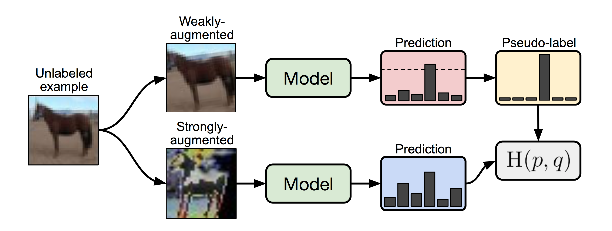
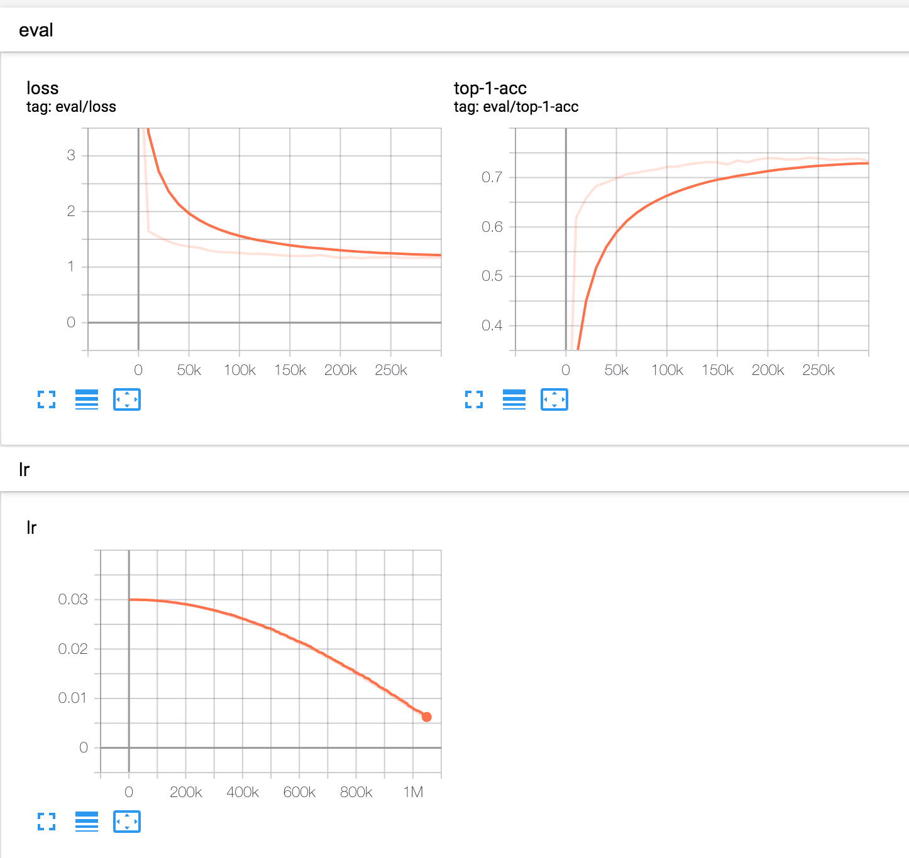
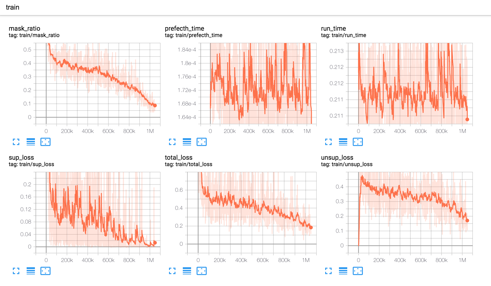

# FixMatch-pytorch
**Unofficial pytorch code** for ["FixMatch: Simplifying Semi-Supervised Learning with Consistency and Confidence,"](https://arxiv.org/abs/2001.07685) NeurIPS'20.  
This implementation can reproduce the results (CIFAR10 & CIFAR100), which are reported in the paper.  
In addition, it **includes trained models** with semi-supervised and fully supervised manners (download them on below links).



## Requirements
- python 3.6
- pytorch 1.6.0
- torchvision 0.7.0
- tensorboard 2.3.0
- pillow

## Results: Classification Accuracy (%)
In addition to the results of semi-supervised learning in the paper, we also attach extra results of fully supervised learning (50000 labels, sup only) + consistency regularization (50000 labels, sup+consistency).  
Consistency regularization also improves the classification accuracy, even though the labels are fully provided.  
Evaluation is conducted by EMA (exponential moving average) of models in the SGD training trajectory.

### CIFAR10

| #Labels | 40 | 250 | 4000 | sup + consistency | sup only |
|:---|:---:|:---:|:---:|:---:|:---:|
|Paper (RA) | 86.19 ± 3.37 | 94.93 ± 0.65 | 95.74 ± 0.05 | - | - |
|[kekmodel](https://github.com/kekmodel/FixMatch-pytorch) | - | - | 94.72 | - | - |
|[valencebond](https://github.com/valencebond/FixMatch_pytorch) | 89.63(85.65) | 93.08 |94.72| - | - |
| **Ours** | 87.11 | 94.61 | 95.62 | 96.86 | 94.98 |
| Trained Moels | [checkpoint](https://drive.google.com/file/d/1eXKnrsrADKay4_9Mjifb60NhTKYO2tuz/view?usp=sharing) | [checkpoint](https://drive.google.com/file/d/1lZbyLWLFEC3TLldE0hk7ofPf-wLkif5M/view?usp=sharing) | [checkpoint](https://drive.google.com/file/d/1ysRVvLMuOjxSSF1KCTEC8-3sczDl6YlP/view?usp=sharing) | [checkpoint](https://drive.google.com/file/d/1xs8G8oADl1M8t3J7wKT_8K5E25fkg-IS/view?usp=sharing) | [checkpoint](https://drive.google.com/file/d/1LfUaZQq01ORXUC-kbUeCYYqAj0-C4Yc2/view?usp=sharing) |


### CIFAR100

| #Labels | 400 | 2500 | 10000 | sup + consistency | sup only |
|:---|:---:|:---:|:---:|:---:|:---:|
|Paper (RA) | 51.15 ± 1.75 | 71.71 ± 0.11 | 77.40 ± 0.12 | - | - |
|[kekmodel](https://github.com/kekmodel/FixMatch-pytorch) | - | - | - | - | - |
|[valencebond](https://github.com/valencebond/FixMatch_pytorch) | 53.74 | 67.3169 | 73.26 | - | - |
|**Ours** | 48.96 | 71.50 | 78.27 | 83.86 | 80.57 |
| Trained Moels | [checkpoint](https://drive.google.com/file/d/1yjB2JY6691Wn8YBU3o_vDKksbj8HQTCI/view?usp=sharing) |[checkpoint](https://drive.google.com/file/d/1B8BExDSjxARp7iL_JeKj3eANMMI87lJL/view?usp=sharing) |[checkpoint](https://drive.google.com/file/d/1x91q6gNb2R9ZhBztID4sOkXpgiQcEIVn/view?usp=sharing) |[checkpoint](https://drive.google.com/file/d/1d3dOZ_MydtXlZ4sW_nAGlc97WKIbumyc/view?usp=sharing) |[checkpoint](https://drive.google.com/file/d/1D4j7B-jOiXW_14UhP2E9_MQ9Urwp6gDN/view?usp=sharing) |


In the case of CIFAR100@40, the result does not reach the paper's result and is out of the confidence interval.  
Despite the result, the accuracy with a small amount of labels highly depends on the label selection and other hyperparameters.  
For example, we find that changing the momentum of batch normalization can give better results, closed to the reported accuracies.  

## Evaluation of Checkpoints
### Download Checkpoints
In here, we attached some google drive links, which includes **training logs and the trained models**.  
Because of security issues of google drive,  
you may fail to download each checkpoint in the result tables by curl/wget.  
Then, use [gdown](https://github.com/wkentaro/gdown) to download without the issues.  

All checkpoints are included in [this directory](https://drive.google.com/drive/folders/1sNDkEOs_ezNAEwQEAGger7reL3bney0B?usp=sharing)

### Evaluation Example
After unzip the checkpoints into your own path, you can run
```
python eval.py --load_path saved_models/cifar10_400/model_best.pth --dataset cifar10 --num_classes 10
```

## How to Use to Train
### Important Notes
For the detailed explanations of arguments, see [here](https://github.com/LeeDoYup/FixMatch-pytorch/blob/main/train.py#L232-L314).  
- In training, the model is saved at `os.path.join(args.save_dir, args.save_name)`, after making new directory. If there already exists the path, the code will raise an error to prevent overwriting of trained models by mistake. If you want to overwrite the files, give `--overwrite`.
- By default, FixMatch uses hard (one-hot) pseudo labels. If you want to use soft pseudo labels and sharping (T), give `--hard_label False`. Also, you can adjust the sharping parameters `--T (YOUR_OWN_VALUE) `.
- This code assumes 1 epoch of training, but the number of iterations is 2**20.
- If you restart the training, use `--resume --load_path [YOUR_CHECKPOINT_PATH]`. Then, the checkpoint is loaded to the model, and continues to training from the ceased iteration. see [here](https://github.com/LeeDoYup/FixMatch-pytorch/blob/a79748f02c10bf0ecb9488992604ff1c95aaf263/train.py#L213-L214) and the [related method](https://github.com/LeeDoYup/FixMatch-pytorch/blob/a338e335b2036cb8b1ba067403faac0dfb930d1e/models/fixmatch/fixmatch.py#L256-L274).
- We set the number of workers for `DataLoader` when distributed training with a single node having V100 GPUs x 4 is used.
- If you change the confidence threshold to generate masks in consistency regularization, change [`--p_cutoff`](https://github.com/LeeDoYup/FixMatch-pytorch/blob/a338e335b2036cb8b1ba067403faac0dfb930d1e/train.py#L260).
- With 4 GPUs, for the fast update, **running statistics of BN** is not gathered in distributed training. However, a larger number of GPUs with the same batch size might affect overall accuracies. Then, you can 1) replace BN to syncBN (see [here](https://pytorch.org/docs/stable/generated/torch.nn.SyncBatchNorm.html)) or 2) use `torch.distributed.all_reduce`  for BN buffers before [this line](https://github.com/LeeDoYup/FixMatch-pytorch/blob/a338e335b2036cb8b1ba067403faac0dfb930d1e/models/fixmatch/fixmatch.py#L80).
- We checked that syncBN slightly improves accuracies, but the training time is much increased. Thus, this code doesn't include it.


### Use single GPU
```
python train.py --rank 0 --gpu [0/1/...] @@@other args@@@
```

### Use multi-GPUs (with DataParallel)
```
python train.py --world-size 1 --rank 0 @@@other args@@@
```

### Use multi-GPUs (with distributed training)
#### When you use multi-GPUs, we strongly recommend using distributed training (even with a single node) for high performance.  
**With V100x4 GPUs, CIFAR10 training takes about 16 hours (0.7 days), and CIFAR100 training takes about 62 hours (2.6 days).**

- single node  
```
python train.py --world-size 1 --rank 0 --multiprocessing-distributed @@@other args@@@
```

- multiple nodes (assuming two nodes)
```
# at node 0
python train.py --world-size 2 --rank 0 --dist_url [rank 0's url] --multiprocessing-distributed @@@@other args@@@@
# at node 1
python train.py --world-size 2 --rank 1 --dist_url [rank 0's url] --multiprocessing-distributed @@@@other args@@@@
```

### Run Examples (with single node & multi-GPUs)

#### CIFAR10
```
python train.py --world-size 1 --rank 0 --multiprocessing-distributed --num_labels 4000 --save_name cifar10_4000 --dataset cifar10 --num_classes 10
```

#### CIFAR100

```
python train.py --world-size 1 --rank 0 --multiprocessing-distributed --num_labels 10000 --save_name cifar100_10000 --dataset cifar100 --num_classes 100 --widen_factor 8 --weight_decay 0.001
```
To reproduce the results on CIFAR100, the `--widen_factor` has to be increased to `--widen_factor=8`. (see this [issue](https://github.com/google-research/fixmatch/issues/26) in the official repo.), and `--weight_decay=0.001`.

### Change the backbone networks
In this repo, we use WideResNet with LeakyReLU activations, implemented in `models/net/wrn.py`.  
When you use the WideResNet, you can change widen_factor, leaky_slope, and dropRate by the argument changes.  

For example,  
If you want to use ReLU, just use `--leaky_slope 0.0` in arugments.  

Also, we support to use **various backbone networks in `torchvision.models`**.  
If you want to use other backbone networks in torchvision, change the arguments  
`--net [MODEL's NAME in torchvision] --net_from_name True`

when `--net_from_name True`, other model arguments are ignored except `--net`.

### Mixed Precision Training
If you want to use mixed-precision training for speed-up, add `--amp` in the argument.  
We checked that the training time of each iteration is reduced by about 20-30 %.

### Tensorboard
We trace various metrics, including training accuracy, prefetch & run times, mask ratio of unlabeled data, and learning rates. See the details in [here](https://github.com/LeeDoYup/FixMatch-pytorch/blob/a338e335b2036cb8b1ba067403faac0dfb930d1e/models/fixmatch/fixmatch.py#L172-L184).
You can see the metrics in tensorboard
```
tensorboard --logdir=[SAVE PATH] --port=[YOUR PORT]
```
-----------

  

-----------

  


### Collaborator
- [Yeongjae Cheon (KakaoBrain)](https://github.com/Yeongjae)
